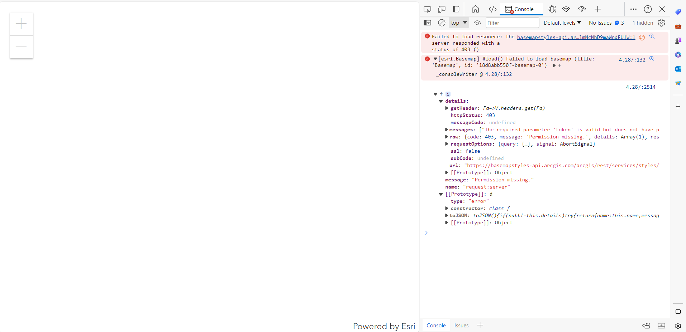

# Bug Report

## Reported By: Laura Jaimes
## Website: [Santa Monica Mountains Map](https://geolaurajaimes.github.io/repo_ljaimesa/ex1displayamap.html)
## Objective: Display a map of Santa Monica Mountains in California
## Taken from [ArcGIS JavaScript API](https://developers.arcgis.com/javascript/latest/get-started/)
## Esri API Key: AAPK8ee79f54a339494c8931908c7f2458bduDivabZwQBmDJf0JrwugKmlUUx7IEjM8aHkYlgZehUfqU01lmNcNhD9maWndFU1W)
## Date Created: 9 - 11 February 2024
## Status: Worked initially, then Broken

### Description
The website was initially functional, displaying a map of the Santa Monica Mountains in California as intended. However, on February 12, 2024, the website stopped functioning correctly, and the following errors were observed in the console:

- Failed to load resource: the server responded with a status of 403 ()
- [esri.Basemap] #load() Failed to load basemap (title: 'Basemap', id: '18d8abb550f-basemap-0') f_consoleWriter @ 4.28/:132
- f details: getHeader: Fa=>V.headers.get(Fa) httpStatus: 403 messageCode: undefined messages: ["The required parameter 'token' is valid but does not have permission to access the service."] raw: {code: 403, message: 'Permission missing.', details: Array(1), restInfoUrl: 'https://basemapstyles-api.arcgis.com/arcgis/rest/info'} requestOptions: {query: {…}, signal: AbortSignal} ssl: false subCode: undefined url: "https://basemapstyles-api.arcgis.com/arcgis/rest/services/styles/v2/webmaps/arcgis/topographic" [[Prototype]]: Object message: "Permission missing." name: "request:server" [[Prototype]]: d type: "error" constructor: class f toJSON: toJSON(){if(null!=this.details)try{return{name:this.name,message:this.message,details:JSON.parse(JSON.stringify(this.details,(e,k)=> {…} [[Prototype]]: Object

### Steps to Reproduce
1. Navigate to [Santa Monica Mountains Map](https://geolaurajaimes.github.io/repo_ljaimesa/ex1displayamap.html)
2. Observe the errors in the browser console.

### Expected Behavior
The website should display a map of the Santa Monica Mountains in California without any errors.

### Actual Behavior
The website is not displaying the map, and the console shows multiple errors related to failed resource loading and permission issues.

### Additional Information
- This issue started occurring on February 12, 2024, after previously working as expected.
- The error messages suggest a permission issue related to accessing the required resources from the ArcGIS servers.
- The Esri API key (AAPK8ee79f54a339494c8931908c7f2458bduDivabZwQBmDJf0JrwugKmlUUx7IEjM8aHkYlgZehUfqU01lmNcNhD9maWndFU1W) used for accessing ArcGIS services appears to be valid but lacks the necessary permissions.
- Permission were revised and are in order, it should work

### Screenshots

### Environment
- Browser: Google Chrome - Microsoft Edge
- Operating System: Windows 10
- Esri API Key: AAPK8ee79f54a339494c8931908c7f2458bduDivabZwQBmDJf0JrwugKmlUUx7IEjM8aHkYlgZehUfqU01lmNcNhD9maWndFU1W
