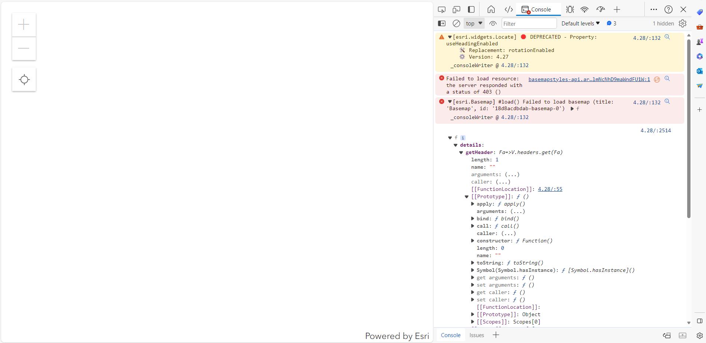

# Bug Report

## Reported By: Laura Jaimes
## Website: [Display Location](https://geolaurajaimes.github.io/repo_ljaimesa/ex2displaylocation.html)
## Objective: ArcGIS Maps SDK for JavaScript Tutorials: Display your location
## Taken from [ArcGIS JavaScript API](https://developers.arcgis.com/javascript/latest/get-started/)
## Date Created: 9 - 11 February 2024
## Status: Broken

### Description
The website initially works in finding user's location using the basemap of arcgis in this website. However, on February 12, 2024, the website stopped functioning correctly, and the following errors were observed in the console:

- [esri.widgets.Locate] 🛑 DEPRECATED - Property: useHeadingEnabled
  🛠️ Replacement: rotationEnabled
  ⚙️ Version: 4.27

- Failed to load resource: the server responded with a status of 403 ()
- [esri.Basemap] #load() Failed to load basemap (title: 'Basemap', id: '18d8acdbdab-basemap-0')

### Steps to Reproduce
1. Navigate to [Display Location](https://geolaurajaimes.github.io/repo_ljaimesa/ex2displaylocation.html)
2. Observe the errors in the browser console.

### Expected Behavior
The website should zoom my location on click in the map without.

### Actual Behavior
The website not displayed the basemap, and the console shows multiple errors related to deprecated properties and failed resource loading.

### Additional Information
- This issue started occurring on February 12, 2024, after previously working as expected.
- The error messages indicate issues with deprecated properties and failed resource loading due to permission errors (status 403).
- The ArcGIS Maps SDK for JavaScript version 4.27 is mentioned as the replacement for the deprecated property.

### Screenshots

### Environment
- Browser: Google Chrome and microsoft bing
- Operating System: Windows 10
- API: Esri API Key: AAPK8ee79f54a339494c8931908c7f2458bduDivabZwQBmDJf0JrwugKmlUUx7IEjM8aHkYlgZehUfqU01lmNcNhD9maWndFU1W
