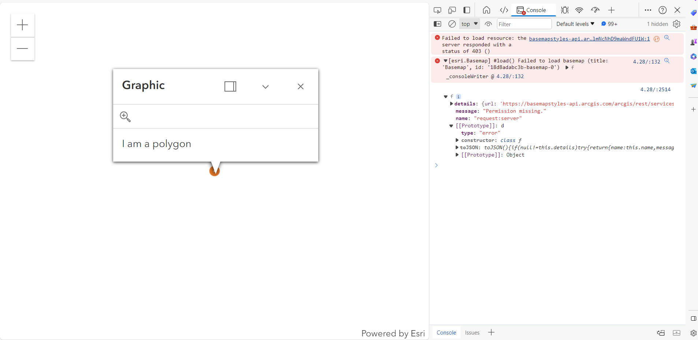

# Bug Report

## Reported By: Laura Jaimes
## Website: [Add a Point, Line, and Polygon](https://geolaurajaimes.github.io/repo_ljaimesa/ex3displayplpg.html)
## Objective: ArcGIS Maps SDK for JavaScript Tutorials: Add a point, line, and polygon in Santa Monica Mountains in California
## Taken from [ArcGIS JavaScript API](https://developers.arcgis.com/javascript/latest/get-started/)
## Date Created: 9 - 11 February 2024
## Status: Worked initially, then Broken

### Description
The website was initially functional, displaying a map with added point, line, and polygon in Santa Monica Mountains in California. However, on February 12, 2024, the website stopped functioning correctly, and the following errors were observed in the console:

- [esri.widgets.Locate] 🛑 DEPRECATED - Property: useHeadingEnabled
  🛠️ Replacement: rotationEnabled
  ⚙️ Version: 4.27

- Failed to load resource: the server responded with a status of 403 ()
- [esri.Basemap] #load() Failed to load basemap (title: 'Basemap', id: '18d8acdbdab-basemap-0')

### Steps to Reproduce
1. Navigate to [Add a Point, Line, and Polygon](https://geolaurajaimes.github.io/repo_ljaimesa/ex3displayplpg.html)
2. Observe the errors in the browser console.

### Expected Behavior
The website should display a map of Santa Monica with added point, line, and polygon.

### Actual Behavior
The website is not displaying the basemap, line and polygon only the point and the popup, the console shows multiple errors related to deprecated properties and failed resource loading.

### Additional Information
- This issue started occurring on February 12, 2024, after previously working as expected.
- The error messages indicate issues with deprecated properties and failed resource loading due to permission errors (status 403).
- The ArcGIS Maps SDK for JavaScript version 4.27 is mentioned as the replacement for the deprecated property.

### Screenshots

### Environment
- Browser: Google Chrome and Bing
- Operating System: Windows 10
- API: AAPK8ee79f54a339494c8931908c7f2458bduDivabZwQBmDJf0JrwugKmlUUx7IEjM8aHkYlgZehUfqU01lmNcNhD9maWndFU1W
					
